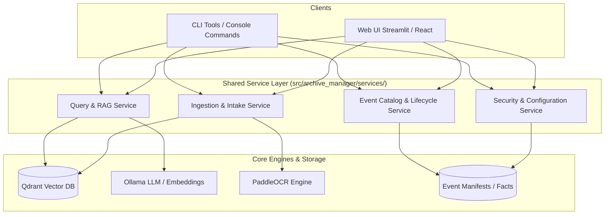

# Archive Manager Web UI Specification & Mockups

This document proposes a user-friendly Web Interface (UI) for `archive_manager`. The design ensures **100% feature parity** with the current CLI and prompt capabilities, making document ingestion, visual multi-page event intake, RAG querying, diagram rendering, lifecycle management, and security controls accessible through an intuitive interface.

---

## 1. Executive Summary & Key Goals

- **Zero Feature Gap**: Every action available via CLI (`archive-query`, `archive-ingest`, `archive-intake`, `archive-watch`, `archive-delete-event`, `archive-purge-expired`, `archive-reset`, `archive-evaluate-queries`, `scripts/sensitive-*`, `scripts/secure-*`) will have a direct visual counterpart.
- **Visual Event Intake**: Drag-and-drop page reordering and metadata form entry to replace multi-argument command-line flags.
- **Rich Media & Diagram Rendering**: Native rendering of Markdown tables and Mermaid code blocks (`flowchart`, `sequenceDiagram`, `subgraph` component diagrams) directly in the chat and query response view.
- **Transparent Security State**: Prominent security status indicator displaying current `ARCHIVE_SECURITY_MODE` (Sensitive vs. Compatibility), active encryption key status, audit identity, and one-click toggle controls.

---

## 2. System Architecture

To ensure code reuse and maintainability, the application logic will be decoupled into a shared service layer (`src/archive_manager/services/`). Both CLI commands and Web UI endpoints will consume this shared service layer.



---

## 3. UI Layout & Wireframe Mockups

The Web UI is organized into a persistent Header and 4 primary Tabs:

```text
+---------------------------------------------------------------------------------------------------------+
| 📁 ARCHIVE MANAGER  |  🔒 Sensitive Mode: ACTIVE  |  👤 User: cliftonhudson  |  🟢 Qdrant  🟢 Ollama  |
+---------------------------------------------------------------------------------------------------------+
|  [ 🔍 1. Search & RAG ]  [ 📥 2. Intake & Ingest ]  [ 📋 3. Event Catalog ]  [ 🛡️ 4. Security & Admin ] |
+---------------------------------------------------------------------------------------------------------+
```

---

### Tab 1: Search & RAG Chat (`archive-query`)

Allows asking questions over indexed documents, selecting output formats (Markdown tables, Mermaid diagrams), viewing extracted facts, inspecting evidence excerpts, and exporting Markdown reports.

#### Wireframe Mockup

```text
+---------------------------------------------------------------------------------------------------------+
| QUERY & SEARCH                                                                                          |
+---------------------------------------------------------------------------------------------------------+
| Question:                                                                                               |
| [ Summarize the car service records for 2025                                                          ] |
|                                                                                                         |
| Output Format: [ Flowchart Diagram ▾ ]   Top-K: [ 10  ]   Filename Filter: [ repair-2025*.png       ] |
| Options:       [x] Strict Authorization   [x] Include Grand Totals    [ ] Save Report Artifact      |
|                                                                                                         |
| < Ask Question >                                                                                        |
+---------------------------------------------------------------------------------------------------------+
| ANSWER & EVIDENCE                                                                                       |
+---------------------------------------------------------------------------------------------------------+
| 📊 Rendered Output (Mermaid Flowchart):                                                                 |
| +-----------------------------------------------------------------------------------------------------+ |
| |  [2025-09-12: Oil Change & Filter] ---> [2025-11-25: Brake Service & Inspection ($1,138.29)]          | |
| +-----------------------------------------------------------------------------------------------------+ |
|                                                                                                         |
| 💬 Summary:                                                                                             |
| Two automotive service events were recorded in 2025. Total charges for 2025: $1,138.29.                 |
|                                                                                                         |
| ▾ Extracted Facts & Metadata                                                                            |
|   • VIN: 2T1BURHE5EC081401 | Service Date: 2025-11-25 | Total: $1,138.29 | Advisor: Kevin Goehle        |
|                                                                                                         |
| ▾ Retrieved Evidence Excerpts (2 chunks retrieved from Qdrant)                                           |
|   [1] Source: repair-2025-11-25.png (Page 1) - Score: 0.892                                              |
|       "RO# 10452 TOTAL CHARGES $1138.29 BRAKE PADS REPLACED..."                                         |
|                                                                                                         |
| [ 💾 Download Report (.md) ]                                                                            |
+---------------------------------------------------------------------------------------------------------+
```

---

### Tab 2: Intake & Ingestion (`archive-ingest`, `archive-intake`, `archive-watch`)

Provides single-file drag-and-drop upload, a visual multi-page Event Intake Wizard (drag to re-order pages), and File Watcher controls.

#### Wireframe Mockup

```text
+---------------------------------------------------------------------------------------------------------+
| INTAKE & INGESTION                                                                                      |
+---------------------------------------------------------------------------------------------------------+
| Mode Selector: (•) Visual Event Intake Wizard    ( ) Direct Single File Ingest    ( ) File Watcher      |
+---------------------------------------------------------------------------------------------------------+
| EVENT INTAKE WIZARD                                                                                     |
|                                                                                                         |
| 1. Upload Pages:                                                                                        |
|    +-----------------------------------------------------------------------------------------------+    |
|    | 📥 Drag & Drop Page Images / PDFs Here or Click to Browse                                     |    |
|    +-----------------------------------------------------------------------------------------------+    |
|                                                                                                         |
| 2. Re-order Pages (Drag thumbnails to adjust order):                                                    |
|    [ 📄 Page 1: invoice_p1.jpg ≡ ]  [ 📄 Page 2: invoice_p2.jpg ≡ ]  [ 📄 Page 3: invoice_p3.jpg ≡ ]   |
|                                                                                                         |
| 3. Event Metadata:                                                                                      |
|    Event ID:      [ repair-2026-08-26          ]  Event Type:   [ Automotive Service ▾ ]             |
|    Subject Ref:   [ VIN-2T1BURHE5EC081401       ]  Audit User:   [ cliftonhudson        ]             |
|    Allowed Users: [ cliftonhudson, alice        ]  Retention:    [ 365 days (Expires 2027-08-26) ]    |
|                                                                                                         |
| < Create Manifest & Process Event >                                                                     |
+---------------------------------------------------------------------------------------------------------+
| FILE WATCHER DAEMON CONTROL                                                                             |
| Status: 🟢 RUNNING | Watched Dir: /Users/cliftonhudson/archive_manager/ARCHIVE | Active Workers: 2        |
| [ ⏸️ Pause Watcher ]  [ ⏹️ Stop Watcher ]                                                              |
+---------------------------------------------------------------------------------------------------------+
```

---

### Tab 3: Event Catalog & Lifecycle (`archive-delete-event`, `archive-purge-expired`, `archive-backfill-event-facts`)

View, search, audit, backfill, and safely delete events with dry-run previews.

#### Wireframe Mockup

```text
+---------------------------------------------------------------------------------------------------------+
| EVENT CATALOG & RETENTION                                                                               |
+---------------------------------------------------------------------------------------------------------+
| Filter Events: [ Search Event ID, Type, or Subject...                      ]  [ Show Expired Only ]     |
|                                                                                                         |
| Event ID           Type                Pages  Owner          Expires      Status     Actions            |
| ------------------ ------------------ ------ -------------- ------------ ---------- ------------------ |
| repair-2025-11-25  automotive_service 4      cliftonhudson  2026-11-25   Active     [ 👁️ View ] [ 🗑️ Delete ]
| tax-2024-q4        tax                2      cliftonhudson  2026-04-15   Active     [ 👁️ View ] [ 🗑️ Delete ]
| medical-2023-05    medical            1      cliftonhudson  2025-05-08   EXPIRED ⚠️  [ 👁️ View ] [ 🗑️ Delete ]
|                                                                                                         |
| [ 🧹 Preview Expired Event Purge ]   [ 🔄 Backfill Extracted Event Facts ]                                |
+---------------------------------------------------------------------------------------------------------+
| DELETE EVENT CONFIRMATION (DRY-RUN PREVIEW)                                                             |
| Modal Window:                                                                                           |
|   Target Event: repair-2025-11-25                                                                       |
|   • 4 Qdrant Vector Points will be deleted                                                              |
|   • 1 Manifest entry in data/events.json will be removed                                                |
|   • 4 OCR text sidecars in data/searchable/ will be removed                                             |
|   • 4 Source files in data/source/ will be removed                                                      |
|                                                                                                         |
|   [ Cancel ]    [ ⚠️ Confirm Permanent Deletion ]                                                        |
+---------------------------------------------------------------------------------------------------------+
```

---

### Tab 4: Security & Admin (`scripts/sensitive-*`, `scripts/secure-*`, `archive-reset`, `archive-evaluate-queries`)

Toggle sensitive environment configurations, run filesystem permission hardening, clear outputs, perform system resets, and execute evaluation suites.

#### Wireframe Mockup

```text
+---------------------------------------------------------------------------------------------------------+
| SECURITY & SYSTEM ADMINISTRATION                                                                        |
+---------------------------------------------------------------------------------------------------------+
| SECURITY CONTROLS                                                                                       |
|                                                                                                         |
| Sensitive Security Mode:  (•) ENABLED (Sensitive - Default) ( ) DISABLED (Compatibility)               |
| Strict Authorization:     ( ) ENABLED (Strict)              (•) DISABLED (Compatibility - Default)     |
| Active Audit User:        [ cliftonhudson                                             ]                 |
| Encryption Key Source:    🔒 Auto-loaded from .archive_key (Fernet AES-128)                             |
| Qdrant API Key:           🔒 Configured (local-secret)                                                 |
| Endpoint Verification:    🟢 OLLAMA (http://localhost:11434)  🟢 PADDLEOCR (http://localhost:8000)       |
|                                                                                                         |
| HARDENING & CLEANUP UTILITIES                                                                           |
| [ 🛡️ Apply 700/600 Filesystem Permissions ]   [ 🧹 Purge Generated Logs & Report Artifacts ]             |
+---------------------------------------------------------------------------------------------------------+
| SYSTEM RESET (DANGER ZONE)                                                                              |
| Select target storage areas to clear:                                                                   |
| [x] Qdrant Collection   [x] Ingest Cache   [x] Source Storage   [x] Manifests & Facts   [x] Logs        |
| [ ⚠️ Preview Reset (Dry Run) ]   [ 💣 Execute System Reset ]                                             |
+---------------------------------------------------------------------------------------------------------+
| QUERY REGRESSION EVALUATION                                                                             |
| Fixture File: [ evaluation_cases.json                                                      ]            |
| [ 🧪 Run Benchmark Suite ]                                                                              |
| Result Summary: Intent Accuracy: 100% | Answer Match: 100% | Avg Latency: 1.2s                             |
+---------------------------------------------------------------------------------------------------------+
```

---

## 4. Feature Mapping Matrix

Every CLI tool and prompt capability maps directly to a Web UI component and service function:

| CLI / Prompt Capability | Command / Argument | UI Component / Action | Shared Service Function |
| :--- | :--- | :--- | :--- |
| **Ask Question** | `archive-query "..."` | **Tab 1**: Query input & response card | `QueryService.answer_question()` |
| **Set Output Format** | Prompt keywords / `--top-k` | **Tab 1**: Format dropdown & sliders | `QueryPlanner.plan_query()` |
| **Save Report** | `archive-query --save-report` | **Tab 1**: Export Report button / checkbox | `QueryService.save_report_artifact()` |
| **Single Ingest** | `archive-ingest file.pdf` | **Tab 2**: File Dropzone | `IngestionService.ingest_file()` |
| **Group Intake** | `archive-intake add` | **Tab 2**: Visual Event Wizard | `IntakeService.create_manifest_and_ingest()` |
| **Watcher Control** | `archive-watch` | **Tab 2**: Watcher Toggle & Status Card | `WatchService.toggle_watcher()` |
| **Delete Event** | `archive-delete-event` | **Tab 3**: Delete Button + Dry Run Modal | `AdminService.delete_event()` |
| **Purge Expired** | `archive-purge-expired` | **Tab 3**: Purge Expired Button | `AdminService.purge_expired()` |
| **Backfill Facts** | `archive-backfill-event-facts` | **Tab 3**: Backfill Facts Button | `AdminService.backfill_facts()` |
| **Toggle Sensitive Mode**| `source scripts/sensitive-on.sh` | **Tab 4**: Sensitive Mode Toggle Switch | `SecurityService.set_security_mode()` |
| **Apply Permissions**| `./scripts/secure-permissions.sh`| **Tab 4**: Apply Permissions Button | `SecurityService.apply_permissions()` |
| **Clean Artifacts** | `./scripts/secure-cleanup.sh` | **Tab 4**: Purge Logs & Reports Button | `SecurityService.secure_cleanup()` |
| **System Reset** | `archive-reset` | **Tab 4**: System Reset Form + Dry Run | `AdminService.reset_archive()` |
| **Run Benchmark** | `archive-evaluate-queries` | **Tab 4**: Benchmark Runner Dashboard | `EvaluationService.run_evaluation()` |

---

## 5. Security & Sensitive Mode Integration in UI

- **Default State**:
  - **Sensitive Security Mode (`ARCHIVE_SECURITY_MODE=sensitive`)**: **ENABLED by default**. All manifests are encrypted at rest (`.archive_key`), trace logs are redacted, local endpoints are verified, and vector payloads are minimized out-of-the-box.
  - **Authorization Mode (`ARCHIVE_AUTH_MODE=compat`)**: **COMPATIBILITY by default**. Allows querying both manifested events and standalone/unmanifested ingested files without requiring `source scripts/sensitive-off.sh`.
- **Strict Authorization Toggle**: Switching to `ARCHIVE_AUTH_MODE=strict` enables access control lists (`metadata.allowed_users`) and denies access to unmanifested documents.
- **Visual Status Badges**: Header badges display current encryption status (🔒 Sensitive Active), authorization mode (Compatibility / Strict), active audit user (`ARCHIVE_AUDIT_USER`), and endpoint health.
- **Fail-Closed Warnings**: If Qdrant API key or encryption key is missing, or if non-local OLLAMA endpoints are specified while in Sensitive Mode, a red alert banner blocks ingestion and retrieval until resolved.
- **Confirmation Modals**: Destructive operations (`Delete Event`, `Purge Expired`, `Archive Reset`) enforce confirmation dialogs with dry-run previews before execution.

---

## 6. Implementation Plan & Milestones

1. **Milestone 1: Refactor Service Layer (`src/archive_manager/services/`)**
   Extract core procedural logic from entry-point CLI modules into clean, reusable service classes.

2. **Milestone 2: Build Interactive Query & Ingestion Web UI (Tabs 1 & 2)**
   Implement Streamlit or FastAPI/React interface for RAG chat, Mermaid diagram rendering, file dropzone, and visual intake wizard.

3. **Milestone 3: Build Catalog, Security & Admin UI (Tabs 3 & 4)**
   Implement event table, retention purges, security state toggle, permission hardening buttons, and evaluation benchmarks.

4. **Milestone 4: Verification & End-to-End Testing**
   Run existing test suite and benchmark evaluation to confirm 100% regression stability.
